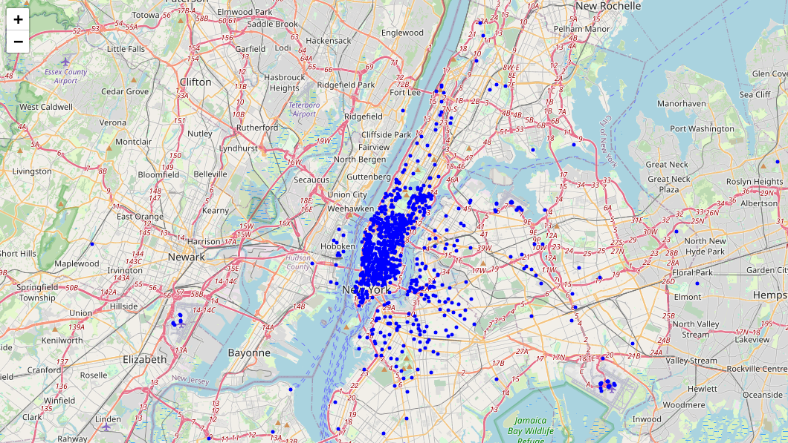

# 🌙 Moonlight Market Analysis

This project analyzes ride patterns and geographic trends in late-night transportation using real Uber trip data.  
It focuses on understanding **where and when** people are getting picked up — especially in nightlife-heavy areas.

---

## 🔍 Project Goals

- Map high-density pickup zones after sunset 🌆  
- Visualize hotspots using Folium + Leaflet.js  
- Compare neighborhoods based on demand  
- Make the analysis **reproducible** and beginner-friendly  

---

## 🧪 Try It Out

### 💻 [Explore the Interactive Map](docs/uber_map_full.html)  
*No setup required — view in browser!*

### 📷 Static Preview  

---

## 📂 Project Structure

